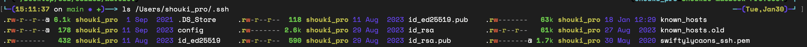
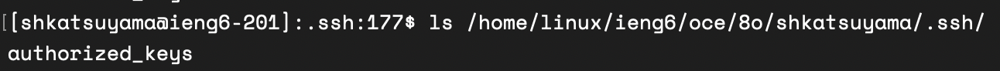
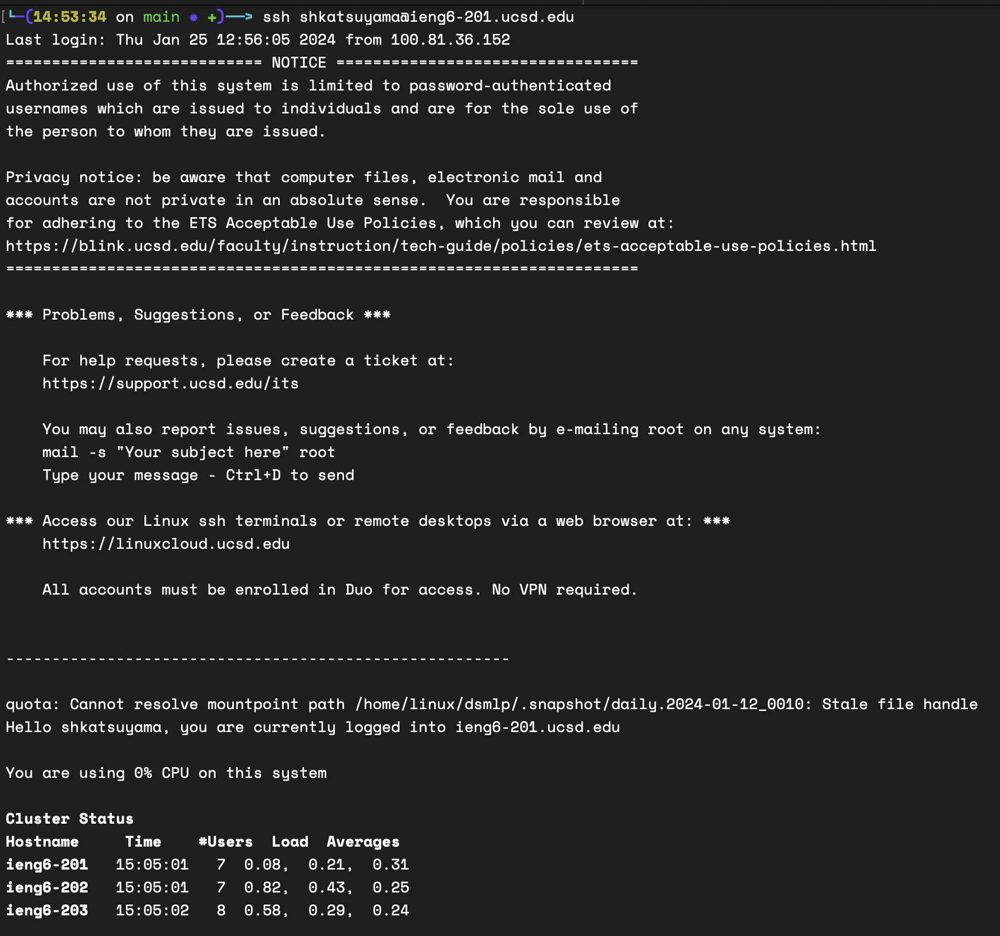

# Lab Report 2 Servers and SSH Key (Week 3) {#week-3-lab-report}
In this blog, I have three parts, `Building a Web Server with Java`, `Connect to Server with SSH Key`, and `What I learned in CSE15L`.

# Building a Web Server with Java
In the first part, I'm going to explain how to build a web server called `ChatServer` which can receive a message and show the added messages. I would explain how we can implement it with Java, and then explain how we can use and show the examples.

## Code
This program is consisted by the two files, `Server.java`, `ChatServer.java`.
* `Server.java`: This file implements the basic elements required to launch the server, so this doesn't contain any specific implementation of chat system.
* `ChatServer.java`: This file implements how to process the received message and show it on the web.

I'm going explain the code step by step. (You can find the entire code in the end of this chapter.)
I skip the explanations on `Server.java` and mainly focus on `ChatServer.java`.

### Import
``` java
import java.io.IOException;
import java.net.URI;
```
In this part, this program imports two libraries of Java, `IOException` and `URI`. `IOException` is for handling the unexpected errors when running the server, and `URI` is the library for web server. By importing these libraries you don't have to implement everything to launch the server.

### Class Header [Handler Class]
``` java
class Handler implements URLHandler {
```
Here, you can define the class. The name of the class is `Handler` and this class implements `URLHandler` (interface). By using the `implements URLHandler`, you can specify the behavior of the class. In this case, it specify you to implement the method `handleRequest`.
### References [Handler Class]
```java
public String ERROR_MESSAGE =
  "You need to give the proper arguments. `/add-message?s=[message]&user=[user]`";
public String[] messages = {};
```
At first, you set two references.
* `ERROR_MESSAGE`: String of Message which can be given when user has input invalid arguments.
* `messages`: Array of String which stores messages.

### URL Path
```java
public String handleRequest(URI url) {
    if (url.getPath().equals("/")) {
      return listMessages();
    } else if (url.getPath().equals("/add-message")) {
      // process message
    }
  }
```
A method `handleRequest` take the url as input and return the string to show on the website. This program has two path.
* `/`: This is the root path to show all the messages. `listMessages()` return the list of messages from `messages`.
* `/add-messages`: This is the path to add the message. We can add message by giving the two arguments `s` is the content of the message and `user` is the name of a user.
  
If given path doesn't match neither of pathes above, it returns the message `404 Not Found!`

### URL Arguments

``` java
String[] parameters = url.getQuery().split("&");
if (parameters.length >= 2) {
  if (parameters[0].startsWith("s=") && parameters[1].startsWith("user=")) {
    if (parameters[0].split("=").length >= 2 && parameters[1].split("=").length >= 2) {
      // process message
    } else {
      return ERROR_MESSAGE;
    }
  } else {
    return ERROR_MESSAGE;
  }
} else {
  return ERROR_MESSAGE;
}
```
Here, we extract two arguments (`s` and `user`). As these the inputs of user, arguments are not always in the valid format. Therefore, we check three criteria (length of arguments, and contain `s=` and `user=`, and contain the content of query). If it doesn't satisfy the requirements, it gives back the `ERROR_MESSAGE`.

### Store Message
``` java
String text = parameters[0].split("=")[1];
String user = parameters[1].split("=")[1];
String newMessage = String.format("%s: %s", user, text);

String[] newMessages = new String[this.messages.length + 1];
for (int i = 0; i < this.messages.length; i++) {
  newMessages[i] = this.messages[i];
}
newMessages[newMessages.length - 1] = newMessage;
this.messages = newMessages;
return listMessages();
```
1. Here, we first extract `text` and `user` from the arguments, create a sentence of message `newMessage` by using the formatting.
2. As java array cannot expand, we create a new array `newMessages` with the expanded length
3. Copy every elements to the new array by using for-loop.
4. Then, put the new message to the end of the new array.
5. Copy the new array to the existing field `messages`.
6. Finally, return the all the message by calling `listMessages()`.

### listMessages function
``` java
public String listMessages() {
  String messageString = "";
  for (String message : this.messages) {
    messageString += message + "\n";
  }
  return messageString;
}
```
This function used above returns the list of messages in the field `messages`.

### ChatServer Class
``` java
class ChatServer {
  public static void main(String[] args) throws IOException {
    if (args.length == 0) {
      System.out.println("Missing port number! Try any number between 1024 to 49151");
      return;
    }

    int port = Integer.parseInt(args[0]);

    Server.start(port, new Handler());
  }
}
```
`main` function in this class when launching the server. We extract the port number from the command line arguments and start the server.

## Examples
We launch the server of port number `4000` by calling the command `java ChatServer 4000`. When the program started, `main` in `ChatServer` is called at first then `Server` is launched.
We can test the server by using the `curl` command liek below:
``` zsh
curl http://localhost:4000/add-message?s=message&user=shouki
```
```
shouki: message
```
When calling this command, `handle` in ` ServerHttpHandler` of `Server.java` is called at first. In `handle`, `handleRequest` is called by `handler.handleRequest(exchange.getRequestURI());`.
When showing the mssages `listMessages()` is called.

This method takes a url as an argument. We can get url by calling `exchange.getRequestURI()`.

When calling the method, `messages` field is updated to new array with expanded lengtha and new message in the end.

If you add more messages, it will show two messages. The entire process are exactly same as above explanation except there is an existing element in `messages` array.
``` zsh
curl http://localhost:4000/add-message?s=message&user=shouki
```
```
shouki: message
katsuyama: message
```
If we input the invalid arguments, it returns as below:
``` zsh
curl http://localhost:4000/add-message?s=message
```
``` zsh
You need to give the proper arguments. `/add-message?s=[message]&user=[user]`
```
In this case, `messages` field doesn't change and `listMessage()` method is not called as well because arguments are invalid.

## Code
``` java
import java.io.IOException;
import java.net.URI;

class Handler implements URLHandler {
  public String ERROR_MESSAGE =
  "You need to give the proper arguments. `/add-message?s=[message]&user=[user]`";
  public String[] messages = {};

  public String handleRequest(URI url) {
    if (url.getPath().equals("/")) {
      return listMessages();
    } else if (url.getPath().equals("/add-message")) {
      String[] parameters = url.getQuery().split("&");
      if (parameters.length >= 2) {
        if (parameters[0].startsWith("s=") && parameters[1].startsWith("user=")) {
          if (parameters[0].split("=").length >= 2 && parameters[1].split("=").length >= 2) {
            String text = parameters[0].split("=")[1];
            String user = parameters[1].split("=")[1];
            String newMessage = String.format("%s: %s", user, text);
            System.out.println(newMessage);

            String[] newMessages = new String[this.messages.length + 1];
            for (int i = 0; i < this.messages.length; i++) {
              newMessages[i] = this.messages[i];
            }
            newMessages[newMessages.length - 1] = newMessage;
            this.messages = newMessages;
            return listMessages();
          } else {
            return ERROR_MESSAGE;
          }
        } else {
          return ERROR_MESSAGE;
        }
      } else {
        return ERROR_MESSAGE;
      }
    }
    return "404 Not Found!";

  }

  public String listMessages() {
    String messageString = "";
    for (String message : this.messages) {
      messageString += message + "\n";
    }
    return messageString;
  }
}

class ChatServer {
  public static void main(String[] args) throws IOException {
    if (args.length == 0) {
      System.out.println("Missing port number! Try any number between 1024 to 49151");
      return;
    }

    int port = Integer.parseInt(args[0]);

    Server.start(port, new Handler());
  }
}

```
# Connect to Server with SSH Key

## Private Key

Private key is the key in the local device to login the server. These keys usually are located in `~/.ssh` folder. We can comfirm by calling `ls /Users/shouki_pro/.ssh`. In this folder, we can see there is a file `id_rsa.pub`.

## Public Key

Public key is the key in the server to allow the login. By calling `ls /home/linux/ieng6/oce/8o/shkatsuyama/.ssh/`, we can see there is a file `authorized_keys` which contains the public key.

## Login to the Server
By calling the command `ssh [username]@[server domain]`. In this example, we called `ssh shkatsuyama@ieng6-201.ucsd.edu` to login the server. As the private key in the device and public key in the server mathces, we don't need to input password.




# What I learned in CSE15L
In week2 and 3, I learned important factors when testing the method. I felt testing is boring and I have never done in my projects in high school. However, I realized testing can help us a lot especially when updating the software. We can make sure the program is not broken after the modification by running the same tests. When I was working on the project in high school, I made the code back to the original when I encountered errors. However, if I had writted testings, I didn't have to do it and could have figured out how to fix errors without making everything back to the original.
