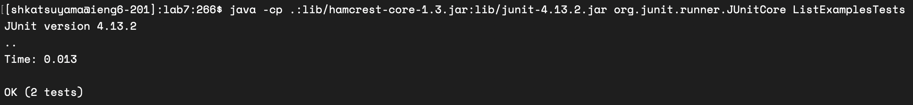
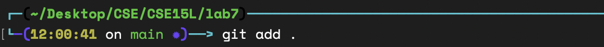
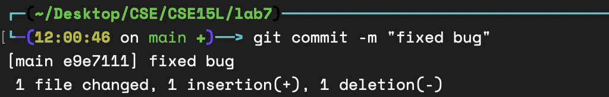
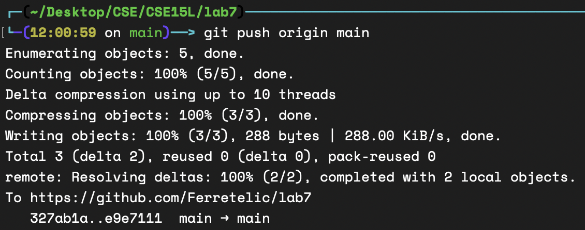

# Lab Report 4 Vim (Week 7) {#week-7-lab-report}
This blog explain how to utilize `vim` command to speed up your coding work.

We explain the step by solving the task as followings:
The main goal of this task to fix the code to pass the test and reflect the change to the github repository.

There are two parts: `Setup` and `Debug`
### Setup
1. Setup Delete any existing forks of the repository you have on your account
2. Setup Fork the repository

### Debug
1. Log into ieng6 (server)
2. Clone your fork of the repository from your Github account (using the SSH URL)
3. Run the tests, demonstrating that they fail
4. Edit the code file to fix the failing test
5. Run the tests, demonstrating that they now succeed
6. Commit and push the resulting change to your Github account (you can pick any commit message!)

# Setup

## Fork the Repository

First, we are going to setup the repository by forking the existing [repository](https://github.com/ucsd-cse15l-s23/lab7).

In the first step, we fork the repository on the web browswer. You can find the `Fork` button upper right of the page.


Once you press the button, it leads to the page where you can set the name and create the copy of the repository in your github account.


You can now see the new repository with your accout name. (In this example it is `Ferretelic`)


## Delete the Repository

To delete the repository you have to press the `Setting` button.


Then scroll all the way down to the bottom. Then press the button `Delete this repository`.


By folliwing the instructions, finally, type your repository name to delete the reporitory.


# Debug
## Log into ieng6 (server)
In the first step, you have to log into the server where you work on the coding. You can use `ssh` command to log into the server.

`ssh` command work with `user name` and `server address`.
```bash
ssh [username]@[server address]
```

In this example, user name is `shkatsuyama` and server address is `ieng6-201.ucsd.edu`.

```bash
ssh shkatsuyama@ieng6-201.ucsd.edu
```

## Clone the Repository
To clone the repository, you first have to get the SSH URL from the web browser.

### Get SSH URL

First, press the green button named `Code`, then it shows the popup.


Then select the `SSH` tab and you can copy the shown url by clicking the button with two square.


### Clone the Repository with Git

Then go back to your command line and clone the repository by using `git` command.

You can use the `git` command as follows. Url does not have to be from GitHub because it is just a one of the web service to do with git system.

```
git [url of the repository]
```

In this example, you can type the following command, but you have to replace the user name (`Ferretelic`) with yours.

```
git clone git@github.com:Ferretelic/lab7.git
```

You can comfirm that you could successfully clone the repository by looking at the output.


## Run the Tests
To run the Java program, you have to first compile the code and then run the program. In this case, we are using the JUnit, so you have to import the library by using special option as following.

In the first step, it is better to change your working directly to the directory you cloned.

```
cd lab7/
```

### Compile the Program

`javac` command can compile the program file ending with `.java`. You can specify the library to use with `-cp`

```
javac -cp [path to Junit] [file path to compile]
```

As you have the JUnit files in the `./lib` directory, you can do as following. By using `*.java`, you can compile all the java files ending with `.java` at the same time.

```
javac -cp .:lib/hamcrest-core-1.3.jar:lib/junit-4.13.2.jar *.java
```

### Run the Program
Then you can use `java` command to run the program. As you did above, you have to includ the library path as well, but this time, you have to include `org.junit.runner.JUnitCore`.

You have to specify the program to run. Unlike the compile, you should not add the extention of the file like `ListExamplesTests`

```
java -cp [path to the JUnit] org.junit.runner.JUnitCore [the name of the program]
```

In this example, you can type the following command.

```
java -cp .:lib/hamcrest-core-1.3.jar:lib/junit-4.13.2.jar org.junit.runner.JUnitCore ListExamplesTests
```

This shows that you failed the 1 test case out of 2.


## Edit the Code File with Vim

You have to edit the program file (`ListExamples.java`) to pass the test. You can use the code editing software like `VSCode` to fix the bug.
However, in this blog, we are going to introduce `vim` command designed to edit a file in a command line to speed up your debug.

First, open the vim editor by typeing the `vim` command.

```
vim [path to the file]
```

To edit the file `ListExamples.java`

```
vim ListExamples.java
```

This will show you the program file.

The general procedure for editing the file is 3step.
1. Move the cursor to the position you want to edit.
2. Enter the Inert Mode
3. Edit the file.
4. Exit the Inset Mode and go back to the Normal Move.
5. Save the File and Exit vim.

### Move the Cursor
The reason you failed the test case is that you incremented the `index1` instead of `index2`.

So you want to change the line
```java
index1 += 1;
```
to
```java
index2 += 1;
```

So, you want to move the cursor to just before the `1` in `index1`.

This line is located in line 44 of the file. To move to the specific line you can use `[The number of line]G` so `44G`. However, it is not always the case that you know the exact line number.
Therefore, you have to press `j` for 44 times to move to the next one by one.

Maybe you find the line is closer from the bottom. You can type `G` to move to the buttom then press `k` 6 times.

Once you move to the line you have to move to the just before `1`.

You can press `w` to move to the begging of the next word. (If you use `44G`, it automatically moves to the begging of the first word in the line so you do not have to press `w`).

To move right by one character, you can press `l`, so you have to press `l` for 5 times.


### Enter the Insert Mode
To go into the Inset Mode, you can type `i`.

You can also go into the Insert Mode while deleting the character. You can delete character by `cl`.
`c` is a command to change the character. `c` works with the `l` which specify how much they change. `l` means going right by one character, so `cl` can remove 1 character on the right and endter the insert mode.

You can just delete the character before going into the Insert Mode by typing `dl`.

### Edit the Line
Once you entered the Insert Mode, you can use `<right>` and `<backspace>` to delete the character then enter `2`.

There is a way where you do not have to enter the Insert Mode to edit the line. You can use `r[character you want to replace with]` to directly replace the character. (You enter the `Replace Mode` and automatically exit after replacing.)
In this example, you can typoe `r2` to make `index1` to `index2`

After the editing the screen would look like this.


### Exit the Insert Mode
To exit the Insert Mode, you can just type `<esc>`.

### Save the File and Exit Vim
To save the file you can type `:w`.
Then you can exit the vim with `:q`.
You can do them at the same time with `:wq`.

### Summary
In the summary, the best way would be as following.

```
44Glllll
r2
:wq
```

You can make sure the file was correctly edited and save with `cat` command.

### ReRun the Tests
You can copy the command and paste it to run the test again. However, there are better way to do that.

Firstly, you can press `<up>` to go back to the commands you types before. To go back to the command you typed 5 times ago, you can type `<up>` for 5 times.
Even if you do not remember when you type it you can continue typing `<up>` to find it.

As another approach, you can use `Reverse-i search`. By tyeping `CTL+R`, you can enter the search mode.

To find `javac` command, you can type `CTL+R javac` then `<enter>` to run the command.


Then to run the command you can type `CTL+Rjava`. However, this command also matches `javac` or `vim ListExamples.java`, so you have to move back to older one by typeing `CTL+R` again or specify more by `java -cp`.
You can go back to newer one by typeing `CTL+S`. (You need to type `stty -ixon` to make it work)


Finally you can comfirm that your program passed the tests.



## Commit and Push
To reflect the change of the file to Github, you have to follow these steps.

1. Add the file.
2. Commit the change.
3. Push the commit.

### Add the file
First you can add the file
```bash
git add [path to the file]
```

To add the file `ListExamples.java`
```bash
git add ./ListExamples.java
```

To add all the file under the current working directly, you can just run below
```
git add .
```


### Commit the change
To commit the change, you can use `git` as follwing.
```
git commit -m [comment]
```
You can write a comment to make it clear what changes have been made.

```
git commit -m "fixed bug"
```
You can see the output as below if you successfully commit the change.



### Pusht the Commit
To push the commit, you have to specify the `remote head` and `branch`

```
git push [remote head] [branch]
```

The default name for `remote head` is `origin` and branch is `main`.

```
git push origin main
```



You can visit the website of Github to check your changes have been reflected.


# Citation
When finding the way to go back to older command in Reverse search, we used ChatGPT.

```
When I use Reverse-i search and type java, it shows the latest but different command  from what I want.
How to show the older one?
```

>When you use the reverse search feature in the shell (often initiated with `Ctrl` + `R` in bash or zsh), it allows you to search through your command history for commands that contain the search term you've entered. Initially, it shows the most recent command that matches your search term. If the first result isn't the command you're looking for, you can press `Ctrl` + `R` again while still in reverse search mode. Each time you press `Ctrl` + `R` after entering your search term, it will move further back through your command history to find the next command that matches the search term.
>So, if the latest command displayed after typing "java" isn't what you want, simply:
> 1. Press `Ctrl` + `R` again without typing anything else.
> 2. Repeat this process until you find the older command you're looking for.
> 
> This method can be very effective for cycling through a series of commands related to a specific term (like "java" in your case) to find the exact one you previously used.

```
How to move back and reverse CTL+R
```

> To move forward in your search history after you've started a reverse search with `Ctrl` + `R`, you can use the `Ctrl` + `S` key combination. However, by default, the `Ctrl` + `S` command is used to pause terminal output (XOFF), so it might not work for searching forward in the command history in its default configuration.
> To enable `Ctrl` + `S` for forward search in the command history, you may need to disable the terminal's default use of `Ctrl` + `S` for stopping terminal output. This can be done by disabling the XOFF flow control for your terminal session. Here's how you can do it:
> 1. Open your terminal.
> 2. Run the command `stty -ixon` to disable XOFF flow control. This command temporarily allows `Ctrl` + `S` to be used for forward search during the current terminal session.
> 
> After running `stty -ixon`, you can use `Ctrl` + `S` to move forward through your command history in the reverse search mode. Remember, you might need to add the `stty -ixon` command to your shell's startup file (like `.bashrc` or `.zshrc`) if you want this change to be permanent for every terminal session.
> Here's a step-by-step guide to use both commands effectively:
> 1. Press `Ctrl` + `R` to start a reverse search. Type your search term (e.g., "java").
> 2. Continue pressing `Ctrl` + `R` to move backwards through your history for older commands that match the search term.
> 3. If you overshoot the command you were looking for, press `Ctrl` + `S` (after enabling it with `stty -ixon`) to move forward in the search results.
> 
> Remember, you might not see feedback or prompts showing `Ctrl` + `S` is working due to how some terminal emulators handle this input, but it will move the search forward through your history.